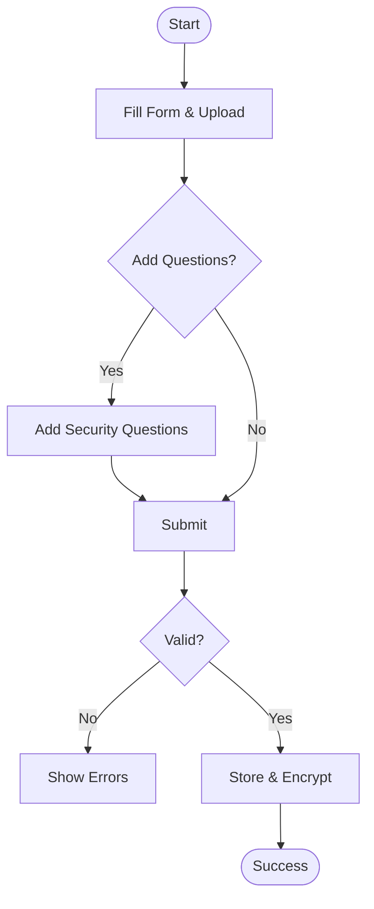
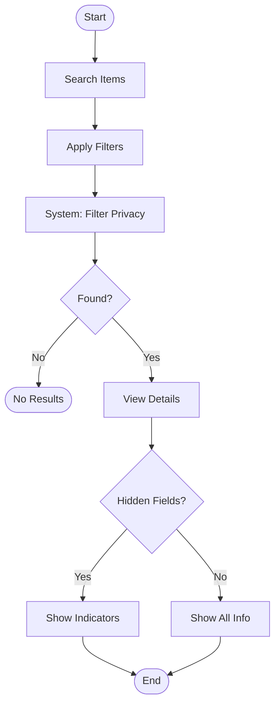
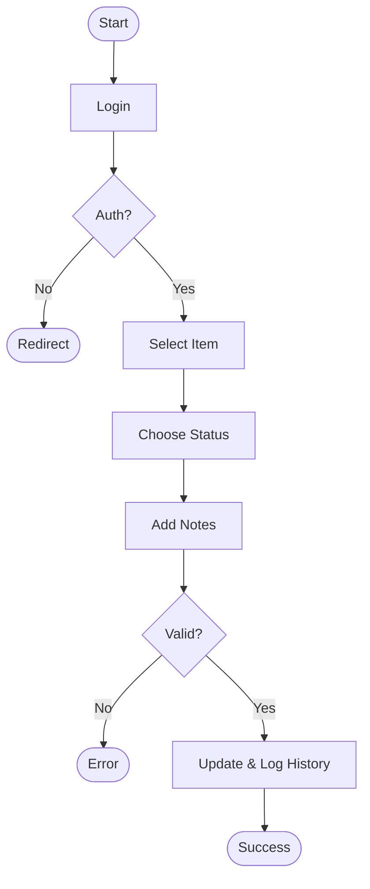
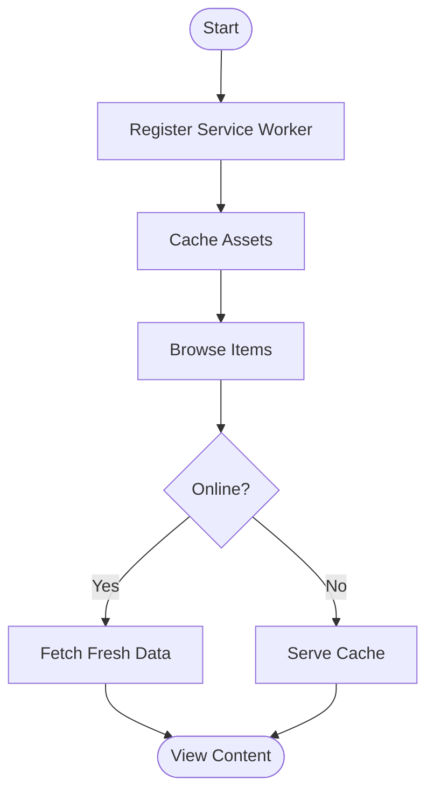

# FindHub Activity Diagrams

## 1. Admin - Create Lost Item with Security Questions

## 2. Public User - Search and View Item

## 3. Admin - Update Item Status with History

## 4. System - Offline Functionality (PWA)

## Activity Diagram Descriptions

### 1. Create Lost Item with Security Questions
Admin workflow for creating a new lost item with optional security questions and privacy controls. The system validates input, encrypts security answers, and stores everything in the database.

### 2. Public User Search and View
Public users search for items with filters. The system automatically filters hidden information based on privacy controls and excludes security questions from the response.

### 3. Update Item Status with History
Admin workflow for updating item status (unclaimed/claimed/disposed) with authentication validation. All status changes are tracked in history with timestamps and notes.

### 4. Offline Functionality (PWA)
Service worker enables offline browsing by caching assets and API responses. When offline, users can view cached content. When online, fresh data is fetched and cache is updated.

## Notes

- **Security**: All security answers are encrypted before storage
- **Privacy**: Hidden fields are filtered at the API level, never sent to public users
- **Authentication**: Admin operations require valid authentication tokens
- **Offline**: Service workers enable offline browsing of cached content
- **History**: All status changes are tracked with timestamps and admin information
