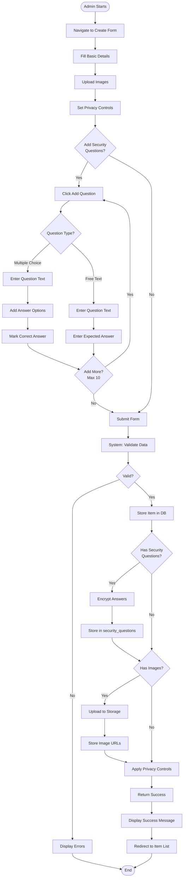
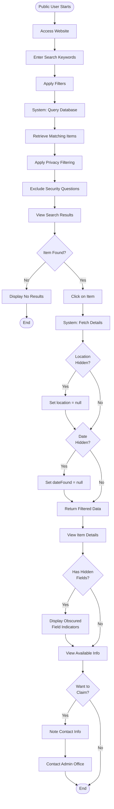
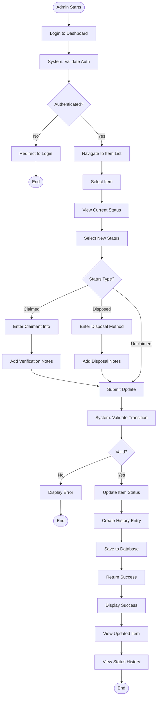
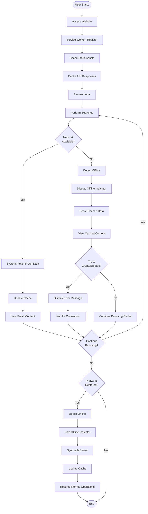

# FindHub Activity Diagrams

## 1. Admin - Create Lost Item with Security Questions

## 2. Public User - Search and View Item

## 3. Admin - Update Item Status with History

## 4. System - Offline Functionality (PWA)

## Activity Diagram Descriptions

### 1. Create Lost Item with Security Questions
This diagram shows the complete workflow for an admin user creating a new lost item with optional security questions and privacy controls. Key steps include:
- Form filling with basic item details
- Image upload
- Privacy control configuration
- Security question creation (multiple choice or free text)
- System validation and encryption
- Database storage

### 2. Public User Search and View
This diagram illustrates how public users search for and view lost items, with the system automatically filtering hidden information. Key steps include:
- Search with filters
- Privacy filtering by system
- Security question exclusion
- Obscured field indicators for hidden data
- Contact information for claiming items

### 3. Update Item Status with History
This diagram shows the admin workflow for updating item status and maintaining status history. Key steps include:
- Authentication validation
- Status selection (unclaimed/claimed/disposed)
- Additional information based on status type
- Status history tracking
- Database updates

### 4. Offline Functionality (PWA)
This diagram demonstrates how the Progressive Web App handles offline scenarios using service workers. Key steps include:
- Service worker registration
- Asset and data caching
- Offline detection
- Cached content serving
- Network restoration and sync

## Notes

- **Security**: All security answers are encrypted before storage
- **Privacy**: Hidden fields are filtered at the API level, never sent to public users
- **Authentication**: Admin operations require valid authentication tokens
- **Offline**: Service workers enable offline browsing of cached content
- **History**: All status changes are tracked with timestamps and admin information
