# FindHub Class Diagram

## Database Schema (Entity Classes)

## Service Layer Classes

## Data Transfer Objects (DTOs)

```mermaid
classDiagram
    class CreateItemInput {
        +String name
        +String description
        +Integer categoryId
        +String keywords
        +String location
        +Date dateFound
        +File[] images
        +String createdById
        +SecurityQuestionInput[] securityQuestions
        +Boolean hideLocation
        +Boolean hideDateFound
    }
    
    class UpdateItemInput {
        +String name
        +String description
        +Integer categoryId
        +String keywords
        +String location
        +Date dateFound
        +File[] images
        +ItemStatus status
        +SecurityQuestionInput[] securityQuestions
        +Boolean hideLocation
        +Boolean hideDateFound
    }
    
    class SecurityQuestionInput {
        +String questionText
        +QuestionType questionType
        +String[] options
        +String answer
        +Integer displayOrder
    }
    
    class StatusUpdateInput {
        +ItemStatus status
        +String notes
        +String changedById
    }
    
    class SearchFilters {
        +String query
        +Integer categoryId
        +String location
        +ItemStatus status
        +Date dateFrom
        +Date dateTo
        +Integer page
        +Integer pageSize
    }
    
    class EncryptedData {
        +String encryptedText
        +String iv
        +String authTag
    }
    
    class LostItemWithImages {
        +LostItem item
        +ItemImage[] images
    }
    
    class LostItemWithSecurity {
        +LostItem item
        +ItemImage[] images
        +SecurityQuestion[] securityQuestions
    }
    
    class LostItemWithDecryptedSecurity {
        +LostItem item
        +ItemImage[] images
        +SecurityQuestionWithDecryptedAnswer[] securityQuestions
    }
    
    class PublicLostItem {
        +LostItem item
        +ItemImage[] images
        +String location
        +Date dateFound
    }
    
    class SecurityQuestionWithDecryptedAnswer {
        +Integer id
        +Integer itemId
        +String questionText
        +QuestionType questionType
        +String[] options
        +String answer
        +Integer displayOrder
    }
    
    class PaginatedResponse~T~ {
        +T[] data
        +Integer total
        +Integer page
        +Integer pageSize
        +Integer totalPages
    }
```

## Class Relationships Summary

### Entity Relationships
- **User** creates multiple **LostItems**, **ItemImages**, **SecurityQuestions**, and **ItemStatusHistory** entries
- **LostItem** belongs to one **ItemCategory** and has multiple **ItemImages**, **SecurityQuestions**, and **ItemStatusHistory** entries
- **SecurityQuestion** uses **QuestionType** enum (multiple_choice or free_text)
- **LostItem** uses **ItemStatus** enum (unclaimed, claimed, returned, archived)

### Service Dependencies
- **ItemsService** orchestrates item management and depends on:
  - **SecurityQuestionsService** for security question operations
  - **CategoryService** for category validation
  - **UploadService** for image storage
- **SecurityQuestionsService** depends on **EncryptionService** for encrypting/decrypting answers

### Data Flow
1. **CreateItemInput/UpdateItemInput** → **ItemsService** → Database entities
2. **SecurityQuestionInput** → **SecurityQuestionsService** → **EncryptionService** → **SecurityQuestion** (encrypted)
3. Database entities → **ItemsService** → **PublicLostItem** (filtered for public) or **LostItemWithDecryptedSecurity** (admin view)

## Key Design Patterns

### Privacy Filtering
- **PublicLostItem** type filters sensitive data based on `hideLocation` and `hideDateFound` flags
- Security questions are never exposed in public API responses

### Encryption
- **EncryptionService** uses AES-256-GCM for encrypting security answers
- Stores encrypted data with IV (initialization vector) and authentication tag
- Decryption only available through admin endpoints

### Soft Delete
- Items are marked as "archived" status instead of hard deletion
- Maintains data integrity and audit trail

### Pagination
- **PaginatedResponse** generic type wraps list responses with metadata
- Supports efficient data retrieval with page/pageSize parameters
