# FindHub System Context Diagram

## C4 Context Diagram (Advanced)

## Flowchart Diagram (Compatible & Editable)

```mermaid
graph TB
    subgraph Users["👥 External Actors"]
        PU[("Public User<br/>Reports & searches<br/>for lost items")]
        AU[("Admin User<br/>Manages item<br/>lifecycle")]
    end
    
    subgraph FindHub["🏢 FindHub System"]
        WEB["📱 Web Application<br/>Next.js PWA<br/>Port: 3001<br/>- Public interface<br/>- Admin dashboard<br/>- Offline support"]
        API["⚙️ API Server<br/>Hono Backend<br/>Port: 3000<br/>- REST endpoints<br/>- Business logic<br/>- File handling"]
        DB[("💾 PostgreSQL<br/>Database<br/>- Lost items<br/>- Users<br/>- Auth sessions")]
    end
    
    subgraph External["🔌 External Systems"]
        FS["📁 File Storage<br/>Image uploads"]
        AUTH["🔐 Better-Auth<br/>Authentication<br/>& sessions"]
    end
    
    PU -->|"HTTPS<br/>Report items<br/>Search items"| WEB
    AU -->|"HTTPS<br/>Manage items<br/>Update status"| WEB
    
    WEB -->|"HTTP/REST<br/>API requests"| API
    API -->|"SQL queries<br/>Read/Write"| DB
    API -->|"File I/O<br/>Upload/Retrieve"| FS
    API -->|"SDK calls<br/>Authenticate"| AUTH
    
    style Users fill:#e1f5ff
    style FindHub fill:#fff4e1
    style External fill:#ffe1f5
    style WEB fill:#4CAF50,color:#fff
    style API fill:#2196F3,color:#fff
    style DB fill:#9C27B0,color:#fff
    style FS fill:#FF9800,color:#fff
    style AUTH fill:#F44336,color:#fff
```

## Diagram Description

This context diagram shows the high-level architecture of the FindHub lost and found management system:

### External Actors
- **Public Users**: Report lost items, search for items, and claim items through security questions
- **Admin Users**: Authenticated staff who manage the item lifecycle (unclaimed → claimed/disposed)

### System Components
- **Web Application (Port 3001)**: Next.js-based Progressive Web App with offline support
- **API Server (Port 3000)**: Hono backend providing RESTful API endpoints
- **PostgreSQL Database**: Persistent storage for items, users, and authentication data

### External Systems
- **File Storage**: Handles uploaded images of lost items
- **Better-Auth**: Provides authentication and session management for admin users

### Key Interactions
1. Users interact with the web application through HTTPS
2. Web app communicates with API server for all data operations
3. API server manages database operations and file storage
4. Authentication flows through Better-Auth integration
