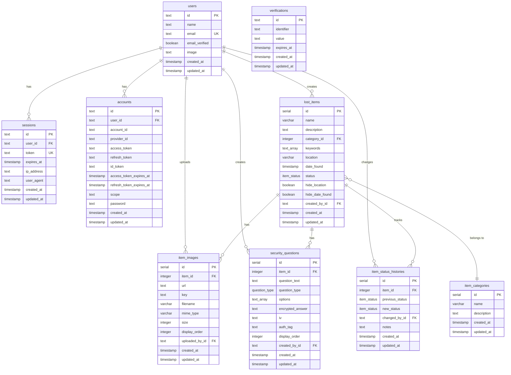

# FindHub Database Design Diagram

## Entity Relationship Diagram (ERD)



## Database Schema Details

### Authentication Tables

#### users
- **Purpose**: Stores user accounts for admin authentication
- **Primary Key**: id (text)
- **Unique Constraints**: email
- **Indexes**: None (small table)

#### sessions
- **Purpose**: Manages user authentication sessions
- **Primary Key**: id (text)
- **Foreign Keys**: user_id → users.id (CASCADE DELETE)
- **Unique Constraints**: token
- **Indexes**: user_id, expires_at


#### accounts
- **Purpose**: Stores OAuth provider accounts and credentials
- **Primary Key**: id (text)
- **Foreign Keys**: user_id → users.id (CASCADE DELETE)
- **Indexes**: user_id, provider_id

#### verifications
- **Purpose**: Stores email verification tokens
- **Primary Key**: id (text)
- **Indexes**: identifier, expires_at

### Core Application Tables

#### lost_items
- **Purpose**: Main table for lost item records
- **Primary Key**: id (serial)
- **Foreign Keys**: 
  - category_id → item_categories.id
  - created_by_id → users.id (CASCADE DELETE)
- **Indexes**: 
  - status
  - category_id
  - date_found
  - created_at
- **Privacy Fields**: hide_location, hide_date_found
- **Status Values**: unclaimed, claimed, returned, archived


#### item_images
- **Purpose**: Stores image metadata for lost items
- **Primary Key**: id (serial)
- **Foreign Keys**: 
  - item_id → lost_items.id (CASCADE DELETE)
  - uploaded_by_id → users.id (CASCADE DELETE)
- **Indexes**: 
  - item_id
  - (item_id, display_order) composite
- **Storage**: Images stored in external file storage, URLs stored here

#### security_questions
- **Purpose**: Stores encrypted security questions for item verification
- **Primary Key**: id (serial)
- **Foreign Keys**: 
  - item_id → lost_items.id (CASCADE DELETE)
  - created_by_id → users.id (CASCADE DELETE)
- **Indexes**: 
  - item_id
  - (item_id, display_order) composite
- **Encryption**: Uses AES-256-GCM with iv and auth_tag
- **Question Types**: multiple_choice, free_text


#### item_categories
- **Purpose**: Categorizes lost items (e.g., Electronics, Clothing)
- **Primary Key**: id (serial)
- **Indexes**: None (small lookup table)

#### item_status_histories
- **Purpose**: Audit trail for item status changes
- **Primary Key**: id (serial)
- **Foreign Keys**: 
  - item_id → lost_items.id (CASCADE DELETE)
  - changed_by_id → users.id (CASCADE DELETE)
- **Indexes**: item_id, created_at
- **Tracks**: Previous status, new status, timestamp, admin user, notes

## Enumerations

### item_status
- `unclaimed` - Item is available and unclaimed
- `claimed` - Item has been claimed by owner
- `returned` - Item has been returned to owner
- `archived` - Item has been deleted (soft delete)

### question_type
- `multiple_choice` - Question with predefined answer options
- `free_text` - Question with free-form text answer


## Relationships

### One-to-Many Relationships
- **users → sessions**: One user can have multiple active sessions
- **users → accounts**: One user can have multiple OAuth provider accounts
- **users → lost_items**: One user (admin) can create multiple lost items
- **users → item_images**: One user can upload multiple images
- **users → security_questions**: One user can create multiple security questions
- **users → item_status_histories**: One user can make multiple status changes
- **lost_items → item_images**: One item can have multiple images
- **lost_items → security_questions**: One item can have multiple security questions
- **lost_items → item_status_histories**: One item can have multiple status history entries

### Many-to-One Relationships
- **lost_items → item_categories**: Many items belong to one category

## Cascade Delete Rules

All foreign key relationships use `CASCADE DELETE` to maintain referential integrity:
- Deleting a **user** cascades to their sessions, accounts, created items, uploaded images, security questions, and status changes
- Deleting a **lost_item** cascades to its images, security questions, and status history
- Deleting a **category** does NOT cascade (set to NULL or prevent deletion if items exist)


## Indexes Strategy

### Performance Indexes
- **lost_items.status**: Fast filtering by item status
- **lost_items.category_id**: Fast filtering by category
- **lost_items.date_found**: Fast date range queries
- **lost_items.created_at**: Fast sorting by creation date
- **item_images.item_id**: Fast lookup of item images
- **(item_images.item_id, item_images.display_order)**: Fast ordered retrieval
- **security_questions.item_id**: Fast lookup of item questions
- **(security_questions.item_id, security_questions.display_order)**: Fast ordered retrieval
- **item_status_histories.item_id**: Fast lookup of item history

### Unique Indexes
- **users.email**: Prevent duplicate user emails
- **sessions.token**: Ensure unique session tokens

## Security Considerations

### Encryption
- **security_questions.encrypted_answer**: Encrypted using AES-256-GCM
- **security_questions.iv**: Initialization vector for encryption
- **security_questions.auth_tag**: Authentication tag for data integrity verification

### Privacy Controls
- **lost_items.hide_location**: Boolean flag to hide location from public
- **lost_items.hide_date_found**: Boolean flag to hide date from public
- Public API filters these fields based on flags
- Admin API always returns complete data

### Soft Delete
- Items are marked as `archived` status instead of hard deletion
- Maintains referential integrity and audit trail
- Cascade deletes still work for cleanup operations


## Data Types

### PostgreSQL-Specific Types
- **serial**: Auto-incrementing integer (4 bytes)
- **text**: Variable-length string (unlimited)
- **varchar(n)**: Variable-length string with limit
- **boolean**: True/false value
- **timestamp**: Date and time with timezone
- **text[]**: Array of text values
- **enum**: Custom enumeration type

### Custom Types
- **item_status**: ENUM('unclaimed', 'claimed', 'returned', 'archived')
- **question_type**: ENUM('multiple_choice', 'free_text')

## Timestamps

All tables include automatic timestamp management:
- **created_at**: Set to current timestamp on INSERT
- **updated_at**: Set to current timestamp on INSERT and UPDATE

## Sample Queries

### Get public items with privacy filtering
```sql
SELECT 
  id, name, description, category_id, status,
  CASE WHEN hide_location THEN NULL ELSE location END as location,
  CASE WHEN hide_date_found THEN NULL ELSE date_found END as date_found
FROM lost_items
WHERE status != 'archived';
```

### Get item with decrypted security questions (admin only)
```sql
SELECT 
  li.*,
  sq.id as question_id,
  sq.question_text,
  sq.question_type,
  sq.options,
  sq.encrypted_answer,
  sq.iv,
  sq.auth_tag
FROM lost_items li
LEFT JOIN security_questions sq ON li.id = sq.item_id
WHERE li.id = $1
ORDER BY sq.display_order;
```

### Get item status history
```sql
SELECT 
  ish.*,
  u.name as changed_by_name
FROM item_status_histories ish
JOIN users u ON ish.changed_by_id = u.id
WHERE ish.item_id = $1
ORDER BY ish.created_at DESC;
```
