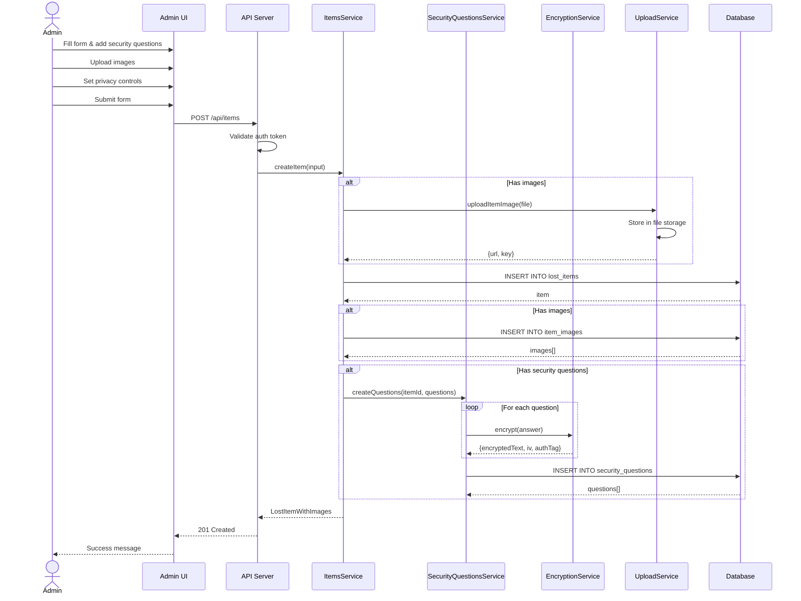
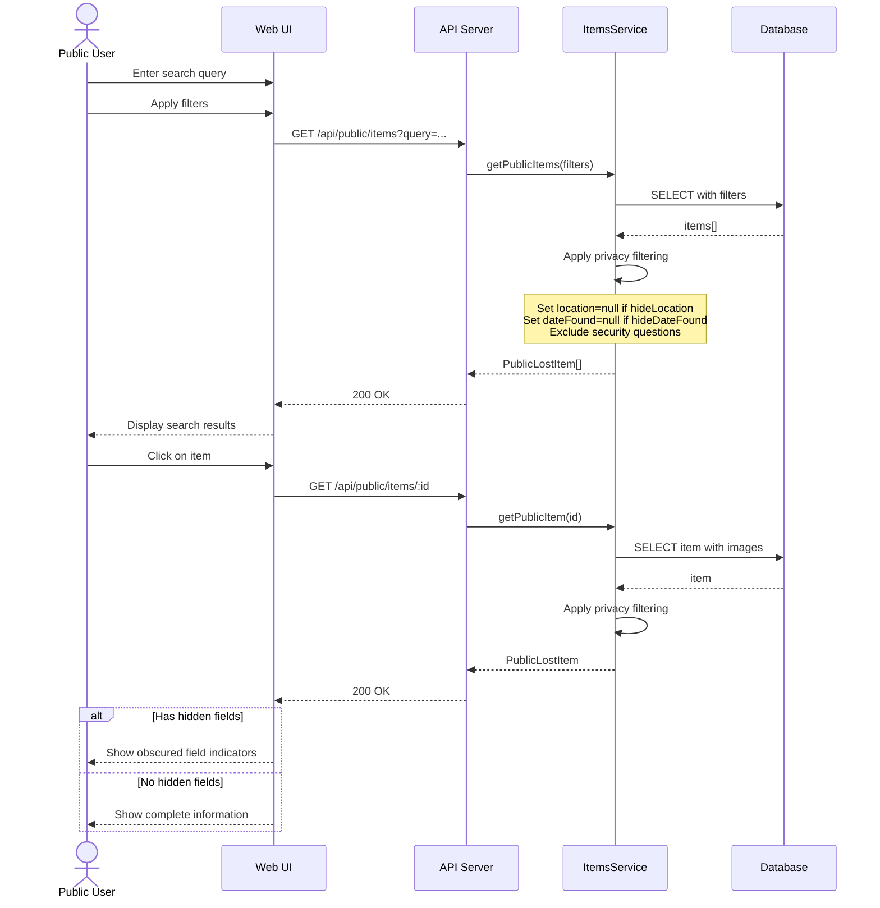
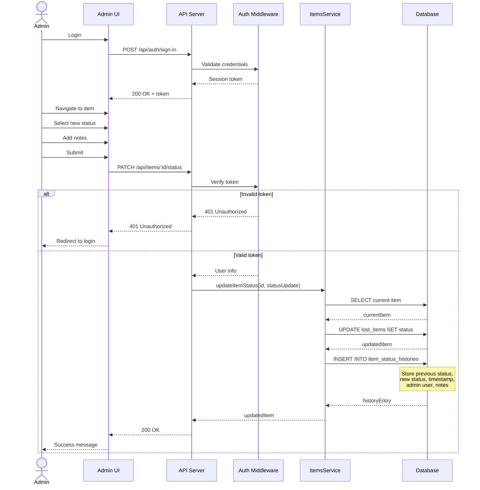
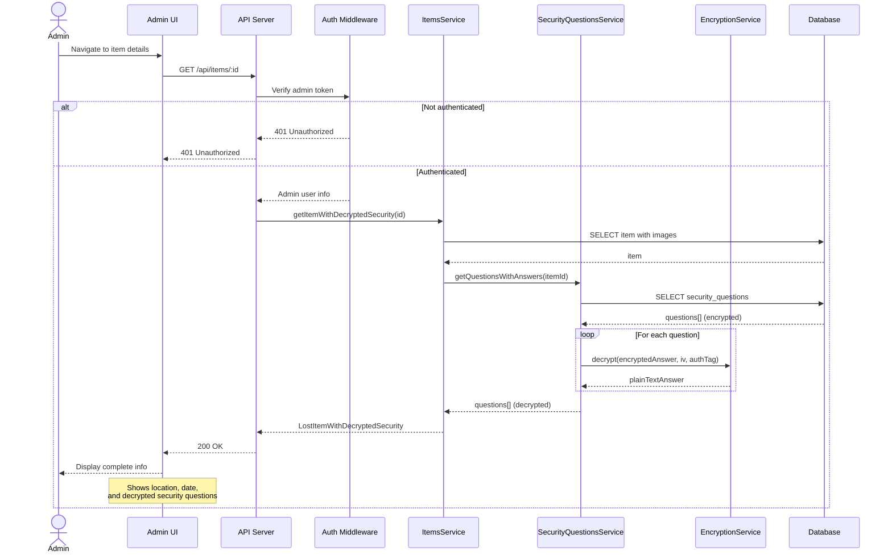
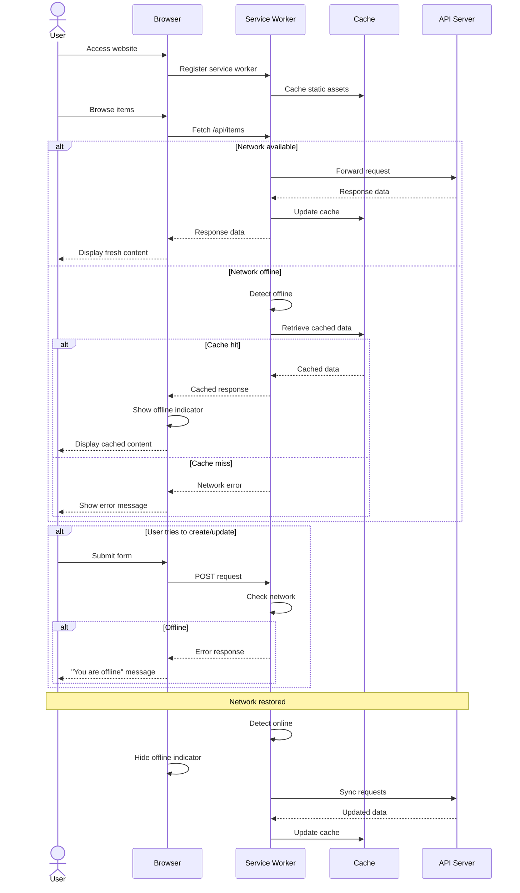
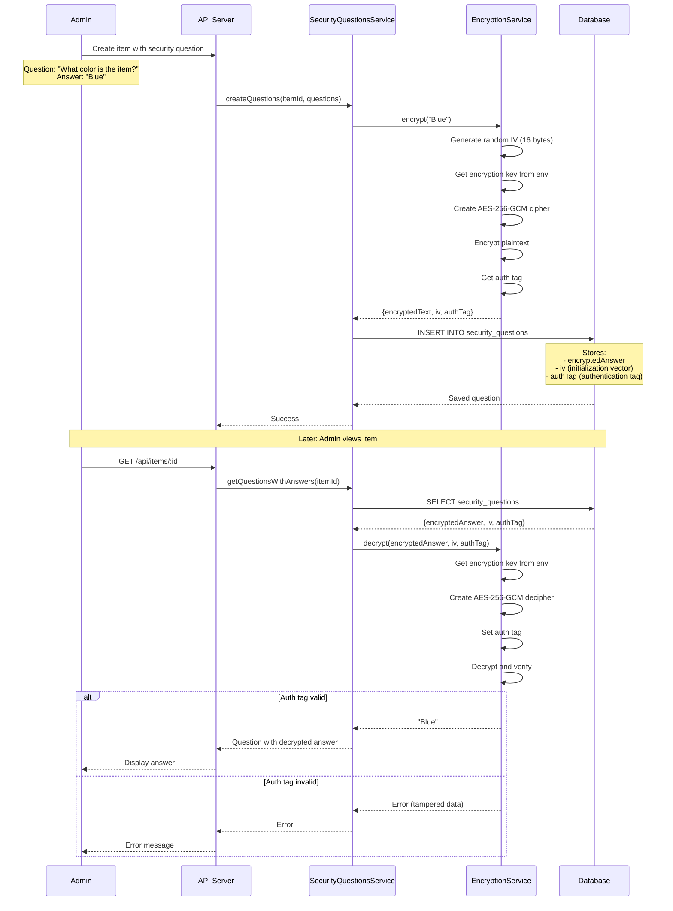

# FindHub Sequence Diagrams

## 1. Admin Creates Lost Item with Security Questions

## 2. Public User Searches and Views Item

## 3. Admin Updates Item Status with History

## 4. Admin Views Item with Decrypted Security Questions

## 5. System Handles Offline Request (PWA)

## 6. Security Question Encryption Flow

## Sequence Diagram Descriptions

### 1. Admin Creates Lost Item with Security Questions
Shows the complete flow of creating a lost item including image uploads, security question encryption, and privacy control settings. Demonstrates how the system coordinates between multiple services.

### 2. Public User Searches and Views Item
Illustrates how public users search for items and how the system automatically filters hidden information based on privacy controls. Security questions are never exposed to public users.

### 3. Admin Updates Item Status with History
Demonstrates the authentication flow and status update process with automatic history tracking. Shows how the system maintains an audit trail of all status changes.

### 4. Admin Views Item with Decrypted Security Questions
Shows how admin users can view complete item information including decrypted security questions. Highlights the authentication requirement and decryption process.

### 5. System Handles Offline Request (PWA)
Illustrates how the service worker handles online/offline scenarios, caching strategies, and user feedback. Shows the difference between read operations (cached) and write operations (require network).

### 6. Security Question Encryption Flow
Detailed view of the encryption/decryption process using AES-256-GCM. Shows how the system generates initialization vectors, encrypts data, stores authentication tags, and verifies data integrity during decryption.

## Key Interactions

- **Authentication**: All admin operations require valid authentication tokens
- **Privacy Filtering**: System automatically filters hidden fields for public API responses
- **Encryption**: Security answers are encrypted before storage and decrypted only for admin users
- **Caching**: Service worker caches responses for offline access
- **History Tracking**: All status changes are logged with timestamps and user information
- **Error Handling**: System handles authentication failures, network errors, and decryption failures gracefully
