# FindHub Use Case Diagram

## PlantUML Diagram

## Mermaid Diagram (Flowchart Style)

```mermaid
graph TB
    subgraph Actors["👥 Actors"]
        PU["👤 Public User<br/>(Student/Visitor)"]
        AU["👨‍💼 Admin User<br/>(Staff Member)"]
        SYS["🤖 System<br/>(Automated)"]
    end
    
    subgraph PublicUseCases["🌐 Public User Use Cases"]
        UC1["🔍 Search Lost Items"]
        UC2["👁️ View Item Details"]
        UC3["🏷️ Filter by Category"]
        UC4["📅 Filter by Date Range"]
        UC5["📍 Filter by Location"]
        UC6["📱 Access Offline"]
        UC7["ℹ️ View About Page"]
        UC8["📞 Get Contact Info"]
    end
    
    subgraph AdminUseCases["🔐 Admin User Use Cases"]
        UC9["🔑 Login to Admin"]
        UC10["➕ Create Lost Item"]
        UC11["✏️ Edit Lost Item"]
        UC12["🗑️ Delete Lost Item"]
        UC13["📊 Update Item Status"]
        UC14["📸 Upload Item Images"]
        UC15["❓ Add Security Questions"]
        UC16["🔒 Set Privacy Controls"]
        UC17["👁️ View Complete Info"]
        UC18["📝 Edit Security Questions"]
        UC19["🔄 Manage Status History"]
    end
    
    subgraph SystemUseCases["⚙️ System Use Cases"]
        UC20["🔐 Encrypt Security Answers"]
        UC21["🚫 Filter Hidden Fields"]
        UC22["🔓 Decrypt for Admin"]
        UC23["💾 Cache for Offline"]
        UC24["🗄️ Store Images"]
        UC25["🔍 Validate Authentication"]
    end
    
    %% Public User Relationships
    PU --> UC1
    PU --> UC2
    PU --> UC3
    PU --> UC4
    PU --> UC5
    PU --> UC6
    PU --> UC7
    PU --> UC8
    
    %% Admin User Relationships
    AU --> UC9
    AU --> UC10
    AU --> UC11
    AU --> UC12
    AU --> UC13
    AU --> UC14
    AU --> UC15
    AU --> UC16
    AU --> UC17
    AU --> UC18
    AU --> UC19
    
    %% Use Case Dependencies (includes)
    UC2 -.->|includes| UC21
    UC10 -.->|includes| UC14
    UC10 -.->|includes| UC15
    UC10 -.->|includes| UC16
    UC10 -.->|includes| UC20
    UC11 -.->|includes| UC18
    UC11 -.->|includes| UC16
    UC13 -.->|includes| UC19
    UC15 -.->|includes| UC20
    UC17 -.->|includes| UC22
    UC18 -.->|includes| UC20
    
    %% System Triggered Use Cases
    SYS --> UC20
    SYS --> UC21
    SYS --> UC22
    SYS --> UC23
    SYS --> UC24
    SYS --> UC25
    
    %% Authentication Extension
    UC9 -.->|extends| UC10
    UC9 -.->|extends| UC11
    UC9 -.->|extends| UC12
    UC9 -.->|extends| UC13
    UC9 -.->|extends| UC17
    
    %% Styling
    style Actors fill:#e1f5ff
    style PublicUseCases fill:#e8f5e9
    style AdminUseCases fill:#fff3e0
    style SystemUseCases fill:#f3e5f5
    
    style PU fill:#4CAF50,color:#fff
    style AU fill:#FF9800,color:#fff
    style SYS fill:#9C27B0,color:#fff
```

## Use Case Descriptions

### Public User Use Cases

| Use Case | Description | Requirements |
|----------|-------------|--------------|
| **Search Lost Items** | Search for lost items using keywords | Basic functionality |
| **View Item Details** | View detailed information about a specific item | May show obscured fields |
| **Filter by Category** | Filter search results by item category | Search enhancement |
| **Filter by Date Range** | Filter items by date found range | Search enhancement |
| **Filter by Location** | Filter items by location found | Search enhancement |
| **Access Offline** | Access cached items when offline | PWA functionality |
| **View About Page** | View information about the service | Information access |
| **Get Contact Info** | Access admin office contact details | Support access |

### Admin User Use Cases

| Use Case | Description | Requirements |
|----------|-------------|--------------|
| **Login to Admin** | Authenticate to access admin features | Req 8.1, 8.5 |
| **Create Lost Item** | Register a new lost item in the system | Core functionality |
| **Edit Lost Item** | Update existing item information | Core functionality |
| **Delete Lost Item** | Remove an item from the system | Core functionality |
| **Update Item Status** | Change item status (unclaimed/claimed/disposed) | Status workflow |
| **Upload Item Images** | Upload photos of lost items | File handling |
| **Add Security Questions** | Create verification questions for items | Req 1.1-1.9 |
| **Set Privacy Controls** | Hide location/date from public view | Req 3.1-3.7 |
| **View Complete Info** | See all item details including hidden fields | Req 5.1-5.5 |
| **Edit Security Questions** | Modify or remove existing security questions | Req 6.1-6.6 |
| **Manage Status History** | Track and view item status changes | Status tracking |

### System Use Cases

| Use Case | Description | Requirements |
|----------|-------------|--------------|
| **Encrypt Security Answers** | Encrypt answers before storing in database | Req 2.2, 2.8 |
| **Filter Hidden Fields** | Remove hidden fields from public API responses | Req 4.1-4.6, 8.3 |
| **Decrypt for Admin** | Decrypt security answers for admin view | Req 8.4 |
| **Cache for Offline** | Store data in service worker cache | PWA functionality |
| **Store Images** | Save uploaded images to file storage | File handling |
| **Validate Authentication** | Verify admin user tokens | Req 8.5 |

## Use Case Relationships

### Includes Relationships
- **View Item Details** includes **Filter Hidden Fields**: System automatically filters hidden fields when public users view items
- **Create Lost Item** includes **Upload Item Images**, **Add Security Questions**, **Set Privacy Controls**, **Encrypt Security Answers**: Creating an item involves these sub-processes
- **Edit Lost Item** includes **Edit Security Questions**, **Set Privacy Controls**: Editing allows modification of these features
- **Update Item Status** includes **Manage Status History**: Status changes are tracked in history

### Extends Relationships
- **Login to Admin** extends all admin use cases: Authentication is required before performing admin actions

### System Triggers
- System automatically encrypts security answers when they are created or updated
- System automatically filters hidden fields for public API responses
- System automatically decrypts answers for authenticated admin users
- System automatically validates authentication tokens on protected endpoints

## Actor Descriptions

### Public User
- **Role**: Unauthenticated student or visitor
- **Access**: Public pages only
- **Capabilities**: Search, view (with restrictions), filter items
- **Restrictions**: Cannot see hidden fields or security questions

### Admin User
- **Role**: Authenticated staff member
- **Access**: Admin dashboard and public pages
- **Capabilities**: Full CRUD operations, security questions, privacy controls
- **Restrictions**: Must authenticate before accessing admin features

### System
- **Role**: Automated processes
- **Responsibilities**: Encryption, filtering, caching, validation
- **Triggers**: API requests, data operations, authentication checks
