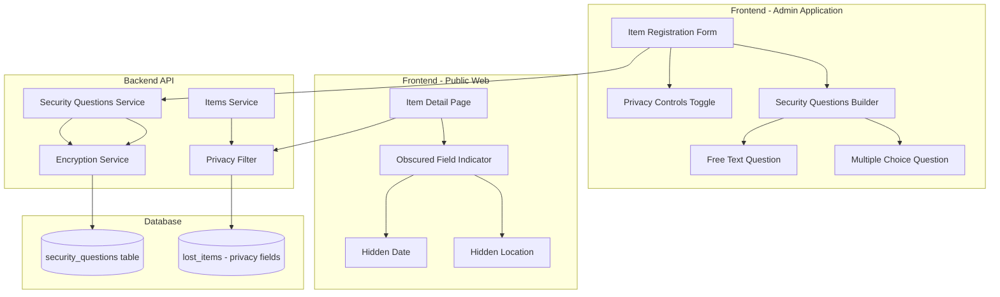

# Design Document: Item Security and Privacy Features

## Overview

This design extends the FindHub lost and found system with security questions and privacy controls. The feature enables administrators to add optional verification questions when registering items and control the visibility of sensitive information (location and date found) to public users. This provides an additional layer of verification for claimants while protecting sensitive details from unauthorized access.

### Key Design Principles

1. **Optional Security**: Security questions are completely optional and flexible
2. **Privacy by Choice**: Admins control what information is public
3. **Secure Storage**: Security answers are encrypted and never exposed to public APIs
4. **Clear Indicators**: Public users see clear UI when information is hidden
5. **Admin Transparency**: Admins always see complete information with visibility indicators

## Architecture

### System Architecture Additions




### Technology Stack Integration

- **Encryption**: Node.js crypto module for AES-256-GCM encryption
- **Database**: PostgreSQL with new security_questions table
- **ORM**: Drizzle ORM for schema and queries
- **Validation**: Zod schemas for security question validation
- **UI Components**: shadcn/ui components for question builder and privacy toggles
- **State Management**: React Hook Form for complex question forms

## Database Schema

### New Security Questions Table

```typescript
// packages/db/src/schema/items.ts additions

export const questionTypeEnum = pgEnum("question_type", [
  "multiple_choice",
  "free_text",
]);

export const securityQuestions = pgTable(
  "security_questions",
  {
    id: serial("id").primaryKey(),
    itemId: integer("item_id")
      .notNull()
      .references(() => lostItems.id, { onDelete: "cascade" }),
    questionText: text("question_text").notNull(),
    questionType: questionTypeEnum("question_type").notNull(),
    // For multiple choice: JSON array of options
    // For free text: null
    options: text("options").array(),
    // Encrypted answer data
    // For multiple choice: index of correct option (encrypted)
    // For free text: expected answer text (encrypted)
    encryptedAnswer: text("encrypted_answer").notNull(),
    // Encryption metadata
    iv: text("iv").notNull(), // Initialization vector for AES-GCM
    authTag: text("auth_tag").notNull(), // Authentication tag for AES-GCM
    displayOrder: integer("display_order").notNull().default(0),
    createdById: text("created_by_id")
      .notNull()
      .references(() => users.id, { onDelete: "cascade" }),
    ...timestamps,
  },
  (table) => [
    index("security_questions_item_id_idx").on(table.itemId),
    index("security_questions_display_order_idx").on(table.itemId, table.displayOrder),
  ],
);
```

### Lost Items Table Modifications

```typescript
// Add privacy control fields to existing lostItems table

export const lostItems = pgTable(
  "lost_items",
  {
    // ... existing fields ...
    hideLocation: boolean("hide_location").notNull().default(false),
    hideDateFound: boolean("hide_date_found").notNull().default(false),
    // ... existing timestamps ...
  },
  // ... existing indexes ...
);
```

### TypeScript Types

```typescript
// packages/db/src/schema/items.ts type additions

export type QuestionType = (typeof questionTypeEnum.enumValues)[number];

export type SecurityQuestion = typeof securityQuestions.$inferSelect;

export interface SecurityQuestionWithDecryptedAnswer extends Omit<SecurityQuestion, 'encryptedAnswer' | 'iv' | 'authTag'> {
  answer: string; // Decrypted answer (admin view only)
}

export interface SecurityQuestionInput {
  questionText: string;
  questionType: QuestionType;
  options?: string[]; // For multiple choice
  answer: string; // Plain text answer to be encrypted
  displayOrder?: number;
}

// Extended lost item type with security questions
export type LostItemWithSecurity = LostItemWithImages & {
  securityQuestions: SecurityQuestion[];
  hideLocation: boolean;
  hideDateFound: boolean;
};

// Public view type (filtered)
export type PublicLostItem = Omit<LostItemWithImages, 'securityQuestions'> & {
  location: string | null; // null if hidden
  dateFound: Date | null; // null if hidden
  hideLocation: boolean;
  hideDateFound: boolean;
};
```


## Components and Interfaces

### Admin Application Components

#### Security Questions Builder Component

```typescript
// apps/admin/src/features/items/components/security-questions-builder.tsx

interface SecurityQuestionBuilderProps {
  questions: SecurityQuestionInput[];
  onChange: (questions: SecurityQuestionInput[]) => void;
}

export function SecurityQuestionsBuilder({ questions, onChange }: SecurityQuestionBuilderProps) {
  // Features:
  // - "Add Security Question" button
  // - Question type selector (multiple choice / free text)
  // - Dynamic form fields based on type
  // - Drag-and-drop reordering
  // - Remove question button
  // - Validation feedback
}
```

**Sub-components:**
- `MultipleChoiceQuestion`: Form for creating multiple choice questions with options
- `FreeTextQuestion`: Form for creating free text questions with expected answer
- `QuestionCard`: Display card for each question with edit/delete actions

#### Privacy Controls Component

```typescript
// apps/admin/src/features/items/components/privacy-controls.tsx

interface PrivacyControlsProps {
  hideLocation: boolean;
  hideDateFound: boolean;
  onHideLocationChange: (hide: boolean) => void;
  onHideDateFoundChange: (hide: boolean) => void;
}

export function PrivacyControls({
  hideLocation,
  hideDateFound,
  onHideLocationChange,
  onHideDateFoundChange,
}: PrivacyControlsProps) {
  // Features:
  // - Toggle switches for location and date
  // - Clear labels and descriptions
  // - Visual preview of what public users will see
}
```

#### Enhanced Item Form

```typescript
// apps/admin/src/features/items/components/item-form.tsx

export function ItemForm({ mode, initialData }: ItemFormProps) {
  // Existing fields...
  // + Security Questions Builder section
  // + Privacy Controls section
  // + Visual indicators for hidden fields in edit mode
}
```

### Public Web Components

#### Obscured Field Indicator

```typescript
// apps/web/src/features/items/components/obscured-field-indicator.tsx

interface ObscuredFieldIndicatorProps {
  fieldName: string; // "location" or "date found"
}

export function ObscuredFieldIndicator({ fieldName }: ObscuredFieldIndicatorProps) {
  return (
    <div className="flex items-center gap-2 p-3 bg-muted rounded-lg border border-border">
      <LockIcon className="h-5 w-5 text-muted-foreground" />
      <div>
        <p className="text-sm font-medium">
          {fieldName} is hidden
        </p>
        <p className="text-xs text-muted-foreground">
          Please contact the admin office for details
        </p>
      </div>
    </div>
  );
}
```

#### Enhanced Item Detail Page

```typescript
// apps/web/src/app/items/[id]/page.tsx

export default function ItemDetailPage({ params }: { params: { id: string } }) {
  // Fetch item with privacy filtering applied
  // Conditionally render location and date or ObscuredFieldIndicator
  // Never show security questions to public users
}
```

### Admin Dashboard Components

#### Security Questions Display

```typescript
// apps/admin/src/features/items/components/security-questions-display.tsx

interface SecurityQuestionsDisplayProps {
  questions: SecurityQuestionWithDecryptedAnswer[];
}

export function SecurityQuestionsDisplay({ questions }: SecurityQuestionsDisplayProps) {
  // Features:
  // - Read-only display of questions and answers
  // - Visual distinction between question types
  // - Expandable/collapsible for space efficiency
}
```

#### Privacy Status Indicators

```typescript
// apps/admin/src/features/items/components/privacy-status-badge.tsx

interface PrivacyStatusBadgeProps {
  hideLocation: boolean;
  hideDateFound: boolean;
}

export function PrivacyStatusBadge({ hideLocation, hideDateFound }: PrivacyStatusBadgeProps) {
  // Shows eye-slash icon with tooltip indicating which fields are hidden
}
```


## Data Models and Validation

### Zod Validation Schemas

```typescript
// packages/shared/src/schemas/security-questions.schema.ts

import { z } from "zod";

export const questionTypeSchema = z.enum(["multiple_choice", "free_text"]);

export const multipleChoiceQuestionSchema = z.object({
  questionText: z.string().min(5, "Question must be at least 5 characters").max(500),
  questionType: z.literal("multiple_choice"),
  options: z
    .array(z.string().min(1).max(200))
    .min(2, "Multiple choice questions must have at least 2 options")
    .max(6, "Maximum 6 options allowed"),
  answer: z.string().min(1, "Must select a correct answer"),
  displayOrder: z.number().int().min(0).optional(),
});

export const freeTextQuestionSchema = z.object({
  questionText: z.string().min(5, "Question must be at least 5 characters").max(500),
  questionType: z.literal("free_text"),
  options: z.undefined(),
  answer: z.string().min(1, "Answer is required").max(500),
  displayOrder: z.number().int().min(0).optional(),
});

export const securityQuestionInputSchema = z.discriminatedUnion("questionType", [
  multipleChoiceQuestionSchema,
  freeTextQuestionSchema,
]);

export const securityQuestionsArraySchema = z
  .array(securityQuestionInputSchema)
  .max(5, "Maximum 5 security questions allowed");

export const privacyControlsSchema = z.object({
  hideLocation: z.boolean().default(false),
  hideDateFound: z.boolean().default(false),
});

// Extended item creation schema
export const createItemWithSecuritySchema = z.object({
  // ... existing item fields ...
  securityQuestions: securityQuestionsArraySchema.optional(),
  hideLocation: z.boolean().default(false),
  hideDateFound: z.boolean().default(false),
});

export const updateItemWithSecuritySchema = createItemWithSecuritySchema.partial();
```


## Backend Services

### Encryption Service

```typescript
// apps/server/src/services/encryption.service.ts

import crypto from "node:crypto";

const ALGORITHM = "aes-256-gcm";
const ENCRYPTION_KEY = process.env.ENCRYPTION_KEY!; // 32-byte key from env

interface EncryptedData {
  encryptedText: string;
  iv: string;
  authTag: string;
}

export class EncryptionService {
  /**
   * Encrypt sensitive data using AES-256-GCM
   */
  static encrypt(plainText: string): EncryptedData {
    // Generate random initialization vector
    const iv = crypto.randomBytes(16);
    
    // Create cipher
    const cipher = crypto.createCipheriv(
      ALGORITHM,
      Buffer.from(ENCRYPTION_KEY, "hex"),
      iv
    );
    
    // Encrypt
    let encrypted = cipher.update(plainText, "utf8", "hex");
    encrypted += cipher.final("hex");
    
    // Get authentication tag
    const authTag = cipher.getAuthTag();
    
    return {
      encryptedText: encrypted,
      iv: iv.toString("hex"),
      authTag: authTag.toString("hex"),
    };
  }

  /**
   * Decrypt sensitive data using AES-256-GCM
   */
  static decrypt(encryptedText: string, iv: string, authTag: string): string {
    // Create decipher
    const decipher = crypto.createDecipheriv(
      ALGORITHM,
      Buffer.from(ENCRYPTION_KEY, "hex"),
      Buffer.from(iv, "hex")
    );
    
    // Set authentication tag
    decipher.setAuthTag(Buffer.from(authTag, "hex"));
    
    // Decrypt
    let decrypted = decipher.update(encryptedText, "hex", "utf8");
    decrypted += decipher.final("utf8");
    
    return decrypted;
  }
}
```

### Security Questions Service

```typescript
// apps/server/src/services/security-questions.service.ts

import { db } from "@findhub/db";
import { securityQuestions } from "@findhub/db/schemas";
import { eq, and } from "drizzle-orm";
import { EncryptionService } from "./encryption.service";
import type { SecurityQuestionInput } from "@findhub/shared/types";

export class SecurityQuestionsService {
  /**
   * Create security questions for an item
   */
  static async createQuestions(
    itemId: number,
    questions: SecurityQuestionInput[],
    createdById: string
  ): Promise<void> {
    const questionsToInsert = questions.map((q, index) => {
      // Encrypt the answer
      const { encryptedText, iv, authTag } = EncryptionService.encrypt(q.answer);
      
      return {
        itemId,
        questionText: q.questionText,
        questionType: q.questionType,
        options: q.questionType === "multiple_choice" ? q.options : null,
        encryptedAnswer: encryptedText,
        iv,
        authTag,
        displayOrder: q.displayOrder ?? index,
        createdById,
      };
    });

    await db.insert(securityQuestions).values(questionsToInsert);
  }

  /**
   * Get security questions for an item (admin only - with decrypted answers)
   */
  static async getQuestionsWithAnswers(
    itemId: number
  ): Promise<SecurityQuestionWithDecryptedAnswer[]> {
    const questions = await db
      .select()
      .from(securityQuestions)
      .where(eq(securityQuestions.itemId, itemId))
      .orderBy(securityQuestions.displayOrder);

    return questions.map((q) => {
      const answer = EncryptionService.decrypt(
        q.encryptedAnswer,
        q.iv,
        q.authTag
      );

      return {
        id: q.id,
        itemId: q.itemId,
        questionText: q.questionText,
        questionType: q.questionType,
        options: q.options,
        answer, // Decrypted
        displayOrder: q.displayOrder,
        createdById: q.createdById,
        createdAt: q.createdAt,
        updatedAt: q.updatedAt,
      };
    });
  }

  /**
   * Update security questions for an item
   */
  static async updateQuestions(
    itemId: number,
    questions: SecurityQuestionInput[],
    userId: string
  ): Promise<void> {
    // Delete existing questions
    await db
      .delete(securityQuestions)
      .where(eq(securityQuestions.itemId, itemId));

    // Create new questions
    if (questions.length > 0) {
      await this.createQuestions(itemId, questions, userId);
    }
  }

  /**
   * Delete all security questions for an item
   */
  static async deleteQuestions(itemId: number): Promise<void> {
    await db
      .delete(securityQuestions)
      .where(eq(securityQuestions.itemId, itemId));
  }
}
```

### Enhanced Items Service

```typescript
// apps/server/src/services/items.service.ts additions

export class ItemsService {
  /**
   * Create item with security questions and privacy controls
   */
  static async createItem(
    data: CreateItemWithSecurityInput,
    userId: string
  ): Promise<LostItemWithSecurity> {
    // Create item with privacy fields
    const [item] = await db
      .insert(lostItems)
      .values({
        name: data.name,
        description: data.description,
        categoryId: data.categoryId,
        keywords: data.keywords,
        location: data.location,
        dateFound: data.dateFound,
        status: data.status ?? "unclaimed",
        hideLocation: data.hideLocation ?? false,
        hideDateFound: data.hideDateFound ?? false,
        createdById: userId,
      })
      .returning();

    // Create security questions if provided
    if (data.securityQuestions && data.securityQuestions.length > 0) {
      await SecurityQuestionsService.createQuestions(
        item.id,
        data.securityQuestions,
        userId
      );
    }

    // Handle image uploads...
    
    return this.getItemWithSecurity(item.id);
  }

  /**
   * Get item with security questions (admin only)
   */
  static async getItemWithSecurity(itemId: number): Promise<LostItemWithSecurity> {
    const item = await this.getItemWithImages(itemId);
    const securityQuestions = await SecurityQuestionsService.getQuestionsWithAnswers(itemId);

    return {
      ...item,
      securityQuestions,
    };
  }

  /**
   * Get item for public view (filtered)
   */
  static async getPublicItem(itemId: number): Promise<PublicLostItem> {
    const item = await this.getItemWithImages(itemId);

    return {
      ...item,
      location: item.hideLocation ? null : item.location,
      dateFound: item.hideDateFound ? null : item.dateFound,
      // Security questions are never included
    };
  }

  /**
   * Update item with security questions and privacy controls
   */
  static async updateItem(
    itemId: number,
    data: UpdateItemWithSecurityInput,
    userId: string
  ): Promise<LostItemWithSecurity> {
    // Update item fields including privacy controls
    await db
      .update(lostItems)
      .set({
        ...data,
        updatedAt: new Date(),
      })
      .where(eq(lostItems.id, itemId));

    // Update security questions if provided
    if (data.securityQuestions !== undefined) {
      await SecurityQuestionsService.updateQuestions(
        itemId,
        data.securityQuestions,
        userId
      );
    }

    return this.getItemWithSecurity(itemId);
  }
}
```


## API Design

### Admin Endpoints (Protected)

```typescript
// POST /api/admin/items
// Create item with security questions and privacy controls
// Body: CreateItemWithSecurityInput
// Response: LostItemWithSecurity

// GET /api/admin/items/:id
// Get item with security questions (decrypted answers)
// Response: LostItemWithSecurity

// PATCH /api/admin/items/:id
// Update item including security questions and privacy controls
// Body: UpdateItemWithSecurityInput
// Response: LostItemWithSecurity

// GET /api/admin/items/:id/security-questions
// Get security questions with decrypted answers
// Response: SecurityQuestionWithDecryptedAnswer[]

// PUT /api/admin/items/:id/security-questions
// Replace all security questions for an item
// Body: SecurityQuestionInput[]
// Response: SecurityQuestionWithDecryptedAnswer[]

// DELETE /api/admin/items/:id/security-questions/:questionId
// Delete a specific security question
// Response: { success: boolean }
```

### Public Endpoints (No Authentication)

```typescript
// GET /api/items/:id
// Get item with privacy filtering applied
// Response: PublicLostItem
// - location is null if hideLocation is true
// - dateFound is null if hideDateFound is true
// - securityQuestions are never included

// GET /api/items
// Search items with privacy filtering
// Query params: keyword, category, location, status, dateFrom, dateTo
// Response: PaginatedResponse<PublicLostItem>
// - Items with hideLocation=true are excluded from location filter results
// - Items with hideDateFound=true are excluded from date range filter results
```

### Request/Response Examples

**Create Item with Security Questions:**

```json
POST /api/admin/items
{
  "name": "Blue Backpack",
  "description": "Blue backpack with laptop compartment",
  "categoryId": 7,
  "location": "Library 3rd Floor",
  "dateFound": "2025-11-15T10:30:00Z",
  "hideLocation": false,
  "hideDateFound": true,
  "securityQuestions": [
    {
      "questionText": "What brand is the laptop inside?",
      "questionType": "free_text",
      "answer": "Dell"
    },
    {
      "questionText": "What color is the keychain attached?",
      "questionType": "multiple_choice",
      "options": ["Red", "Blue", "Green", "Black"],
      "answer": "Red"
    }
  ]
}
```

**Public Item Response (with hidden date):**

```json
GET /api/items/123
{
  "id": 123,
  "name": "Blue Backpack",
  "description": "Blue backpack with laptop compartment",
  "categoryId": 7,
  "location": "Library 3rd Floor",
  "dateFound": null,
  "hideLocation": false,
  "hideDateFound": true,
  "status": "unclaimed",
  "images": [...]
}
```

**Admin Item Response (with security questions):**

```json
GET /api/admin/items/123
{
  "id": 123,
  "name": "Blue Backpack",
  "description": "Blue backpack with laptop compartment",
  "categoryId": 7,
  "location": "Library 3rd Floor",
  "dateFound": "2025-11-15T10:30:00Z",
  "hideLocation": false,
  "hideDateFound": true,
  "status": "unclaimed",
  "images": [...],
  "securityQuestions": [
    {
      "id": 1,
      "questionText": "What brand is the laptop inside?",
      "questionType": "free_text",
      "answer": "Dell",
      "displayOrder": 0
    },
    {
      "id": 2,
      "questionText": "What color is the keychain attached?",
      "questionType": "multiple_choice",
      "options": ["Red", "Blue", "Green", "Black"],
      "answer": "Red",
      "displayOrder": 1
    }
  ]
}
```


## UI/UX Design

### Admin Item Form Layout

```
┌─────────────────────────────────────────────────────────┐
│ Create Lost Item                                        │
├─────────────────────────────────────────────────────────┤
│                                                         │
│ Basic Information                                       │
│ ┌─────────────────────────────────────────────────┐   │
│ │ Name: [________________]                        │   │
│ │ Description: [_________________________]        │   │
│ │ Category: [Select ▼]                            │   │
│ │ Keywords: [________________]                    │   │
│ └─────────────────────────────────────────────────┘   │
│                                                         │
│ Location & Date                                         │
│ ┌─────────────────────────────────────────────────┐   │
│ │ Location: [________________]                    │   │
│ │   ☐ Hide location from public                   │   │
│ │                                                  │   │
│ │ Date Found: [11/15/2025]                        │   │
│ │   ☑ Hide date from public                       │   │
│ └─────────────────────────────────────────────────┘   │
│                                                         │
│ Security Questions (Optional)                           │
│ ┌─────────────────────────────────────────────────┐   │
│ │ [+ Add Security Question]                       │   │
│ │                                                  │   │
│ │ ┌─────────────────────────────────────────┐    │   │
│ │ │ Question 1                        [×]    │    │   │
│ │ │ Type: ● Multiple Choice ○ Free Text     │    │   │
│ │ │                                          │    │   │
│ │ │ Question: What color is the keychain?   │    │   │
│ │ │                                          │    │   │
│ │ │ Options:                                 │    │   │
│ │ │   ○ Red                                  │    │   │
│ │ │   ● Blue  ← Correct Answer               │    │   │
│ │ │   ○ Green                                │    │   │
│ │ │   [+ Add Option]                         │    │   │
│ │ └─────────────────────────────────────────┘    │   │
│ │                                                  │   │
│ │ ┌─────────────────────────────────────────┐    │   │
│ │ │ Question 2                        [×]    │    │   │
│ │ │ Type: ○ Multiple Choice ● Free Text     │    │   │
│ │ │                                          │    │   │
│ │ │ Question: What's inside the bag?        │    │   │
│ │ │                                          │    │   │
│ │ │ Expected Answer: [Laptop and books]     │    │   │
│ │ └─────────────────────────────────────────┘    │   │
│ └─────────────────────────────────────────────────┘   │
│                                                         │
│ Images                                                  │
│ ┌─────────────────────────────────────────────────┐   │
│ │ [Upload Images]                                 │   │
│ └─────────────────────────────────────────────────┘   │
│                                                         │
│ [Cancel]                            [Create Item]       │
└─────────────────────────────────────────────────────────┘
```

### Public Item Detail View (with hidden fields)

```
┌─────────────────────────────────────────────────────────┐
│ Blue Backpack                                           │
├─────────────────────────────────────────────────────────┤
│                                                         │
│ [Image Gallery]                                         │
│                                                         │
│ Description                                             │
│ Blue backpack with laptop compartment found on campus  │
│                                                         │
│ Details                                                 │
│ Category: Bags                                          │
│ Status: Unclaimed                                       │
│                                                         │
│ Location                                                │
│ Library 3rd Floor                                       │
│                                                         │
│ Date Found                                              │
│ ┌─────────────────────────────────────────────────┐   │
│ │ 🔒 Date found is hidden                         │   │
│ │    Please contact the admin office for details  │   │
│ └─────────────────────────────────────────────────┘   │
│                                                         │
│ [Contact Admin Office]                                  │
└─────────────────────────────────────────────────────────┘
```

### Admin Dashboard Item Row (with privacy indicators)

```
┌──────────────────────────────────────────────────────────────┐
│ ID  │ Image │ Name          │ Location      │ Date    │ 🔒  │
├──────────────────────────────────────────────────────────────┤
│ 123 │ [img] │ Blue Backpack │ Library 3F    │ 11/15   │ 🔒📅│
│     │       │               │               │         │     │
└──────────────────────────────────────────────────────────────┘
                                                          ↑
                                        Privacy indicators:
                                        🔒 = location hidden
                                        📅 = date hidden
```


## Error Handling

### Validation Errors

```typescript
// Security question validation errors
{
  "success": false,
  "error": {
    "code": "VALIDATION_ERROR",
    "message": "Invalid security question data",
    "details": [
      {
        "field": "securityQuestions[0].questionText",
        "message": "Question must be at least 5 characters"
      },
      {
        "field": "securityQuestions[1].options",
        "message": "Multiple choice questions must have at least 2 options"
      }
    ]
  }
}
```

### Encryption Errors

```typescript
// Handle encryption/decryption failures
try {
  const decrypted = EncryptionService.decrypt(encrypted, iv, authTag);
} catch (error) {
  // Log error for investigation
  logger.error("Decryption failed", { itemId, error });
  
  // Return generic error to client
  throw new Error("Failed to retrieve security questions");
}
```

### Access Control Errors

```typescript
// Unauthorized access to security questions
{
  "success": false,
  "error": {
    "code": "UNAUTHORIZED",
    "message": "Authentication required to access security questions"
  }
}

// Public API attempting to access encrypted data
{
  "success": false,
  "error": {
    "code": "FORBIDDEN",
    "message": "Security questions are not available through public API"
  }
}
```

## Security Considerations

### Encryption Security

1. **Algorithm**: AES-256-GCM provides authenticated encryption
2. **Key Management**: 
   - 32-byte encryption key stored in environment variable
   - Key should be generated using cryptographically secure random generator
   - Key rotation strategy should be implemented for production
3. **Initialization Vector**: Random 16-byte IV generated for each encryption
4. **Authentication Tag**: GCM mode provides authentication to detect tampering

### Access Control

1. **API Security**:
   - Security questions endpoints require admin authentication
   - Public API never exposes security question data
   - Middleware validates session before allowing access
2. **Database Security**:
   - Encrypted answers stored in database
   - Even with database access, answers cannot be read without encryption key
3. **Frontend Security**:
   - Admin app validates user session before rendering security questions
   - Public app never receives security question data from API

### Privacy Controls

1. **Data Filtering**:
   - Privacy filtering applied at service layer, not just UI
   - Public API returns null for hidden fields
   - Search filters exclude items with hidden fields from filtered results
2. **Audit Trail**:
   - Privacy control changes logged in item update history
   - Security question creation/modification tracked with user ID and timestamp

### Input Validation

1. **Question Limits**:
   - Maximum 5 security questions per item
   - Maximum 6 options per multiple choice question
   - Text length limits enforced (500 chars for questions, 200 for options)
2. **Answer Validation**:
   - Multiple choice: answer must match one of the provided options
   - Free text: answer cannot be empty
3. **Sanitization**:
   - All text inputs sanitized to prevent XSS
   - HTML tags stripped from questions and answers


## Testing Strategy

### Unit Tests

**Encryption Service Tests**:
```typescript
describe("EncryptionService", () => {
  it("should encrypt and decrypt text correctly", () => {
    const plainText = "Dell Laptop";
    const { encryptedText, iv, authTag } = EncryptionService.encrypt(plainText);
    const decrypted = EncryptionService.decrypt(encryptedText, iv, authTag);
    expect(decrypted).toBe(plainText);
  });

  it("should generate unique IVs for each encryption", () => {
    const text = "Same text";
    const result1 = EncryptionService.encrypt(text);
    const result2 = EncryptionService.encrypt(text);
    expect(result1.iv).not.toBe(result2.iv);
    expect(result1.encryptedText).not.toBe(result2.encryptedText);
  });

  it("should fail decryption with wrong auth tag", () => {
    const { encryptedText, iv } = EncryptionService.encrypt("test");
    expect(() => {
      EncryptionService.decrypt(encryptedText, iv, "wrong_tag");
    }).toThrow();
  });
});
```

**Security Questions Service Tests**:
```typescript
describe("SecurityQuestionsService", () => {
  it("should create security questions with encrypted answers", async () => {
    const questions = [
      {
        questionText: "What color?",
        questionType: "free_text",
        answer: "Blue",
      },
    ];
    
    await SecurityQuestionsService.createQuestions(1, questions, "user123");
    
    const saved = await db.select().from(securityQuestions).where(eq(securityQuestions.itemId, 1));
    expect(saved[0].encryptedAnswer).not.toBe("Blue");
    expect(saved[0].iv).toBeDefined();
    expect(saved[0].authTag).toBeDefined();
  });

  it("should decrypt answers when retrieving questions", async () => {
    // Create question with encrypted answer
    await SecurityQuestionsService.createQuestions(
      1,
      [{ questionText: "Test?", questionType: "free_text", answer: "Answer" }],
      "user123"
    );
    
    // Retrieve with decryption
    const questions = await SecurityQuestionsService.getQuestionsWithAnswers(1);
    expect(questions[0].answer).toBe("Answer");
  });
});
```

**Validation Schema Tests**:
```typescript
describe("Security Question Validation", () => {
  it("should validate multiple choice question with correct structure", () => {
    const valid = {
      questionText: "What color?",
      questionType: "multiple_choice",
      options: ["Red", "Blue", "Green"],
      answer: "Blue",
    };
    
    expect(() => securityQuestionInputSchema.parse(valid)).not.toThrow();
  });

  it("should reject multiple choice with less than 2 options", () => {
    const invalid = {
      questionText: "What color?",
      questionType: "multiple_choice",
      options: ["Red"],
      answer: "Red",
    };
    
    expect(() => securityQuestionInputSchema.parse(invalid)).toThrow();
  });

  it("should validate free text question", () => {
    const valid = {
      questionText: "What's inside?",
      questionType: "free_text",
      answer: "Laptop",
    };
    
    expect(() => securityQuestionInputSchema.parse(valid)).not.toThrow();
  });
});
```

### Integration Tests

**API Endpoint Tests**:
```typescript
describe("POST /api/admin/items", () => {
  it("should create item with security questions", async () => {
    const response = await request(app)
      .post("/api/admin/items")
      .set("Authorization", `Bearer ${adminToken}`)
      .send({
        name: "Test Item",
        description: "Test description",
        location: "Test location",
        dateFound: new Date(),
        securityQuestions: [
          {
            questionText: "What color?",
            questionType: "free_text",
            answer: "Blue",
          },
        ],
      });

    expect(response.status).toBe(201);
    expect(response.body.securityQuestions).toHaveLength(1);
    expect(response.body.securityQuestions[0].answer).toBe("Blue");
  });

  it("should reject invalid security questions", async () => {
    const response = await request(app)
      .post("/api/admin/items")
      .set("Authorization", `Bearer ${adminToken}`)
      .send({
        name: "Test Item",
        securityQuestions: [
          {
            questionText: "Q",
            questionType: "free_text",
            answer: "",
          },
        ],
      });

    expect(response.status).toBe(400);
    expect(response.body.error.code).toBe("VALIDATION_ERROR");
  });
});

describe("GET /api/items/:id", () => {
  it("should return null for hidden location", async () => {
    const item = await createTestItem({ hideLocation: true });
    
    const response = await request(app).get(`/api/items/${item.id}`);
    
    expect(response.body.location).toBeNull();
    expect(response.body.hideLocation).toBe(true);
  });

  it("should never return security questions to public", async () => {
    const item = await createTestItemWithSecurityQuestions();
    
    const response = await request(app).get(`/api/items/${item.id}`);
    
    expect(response.body.securityQuestions).toBeUndefined();
  });
});
```

### Component Tests

**Security Questions Builder Tests**:
```typescript
describe("SecurityQuestionsBuilder", () => {
  it("should add new question when button clicked", () => {
    const onChange = jest.fn();
    render(<SecurityQuestionsBuilder questions={[]} onChange={onChange} />);
    
    fireEvent.click(screen.getByText("Add Security Question"));
    
    expect(onChange).toHaveBeenCalledWith([
      expect.objectContaining({
        questionText: "",
        questionType: "free_text",
      }),
    ]);
  });

  it("should remove question when delete clicked", () => {
    const onChange = jest.fn();
    const questions = [
      { questionText: "Test?", questionType: "free_text", answer: "Answer" },
    ];
    
    render(<SecurityQuestionsBuilder questions={questions} onChange={onChange} />);
    
    fireEvent.click(screen.getByLabelText("Remove question"));
    
    expect(onChange).toHaveBeenCalledWith([]);
  });
});
```

**Obscured Field Indicator Tests**:
```typescript
describe("ObscuredFieldIndicator", () => {
  it("should display correct message for location", () => {
    render(<ObscuredFieldIndicator fieldName="location" />);
    
    expect(screen.getByText(/location is hidden/i)).toBeInTheDocument();
    expect(screen.getByText(/contact the admin office/i)).toBeInTheDocument();
  });

  it("should render lock icon", () => {
    render(<ObscuredFieldIndicator fieldName="date found" />);
    
    expect(screen.getByRole("img", { hidden: true })).toBeInTheDocument();
  });
});
```

### E2E Tests (Playwright)

```typescript
test("admin can create item with security questions", async ({ page }) => {
  await page.goto("/admin/items/new");
  
  // Fill basic info
  await page.fill('[name="name"]', "Test Item");
  await page.fill('[name="description"]', "Test description");
  
  // Add security question
  await page.click("text=Add Security Question");
  await page.fill('[name="securityQuestions[0].questionText"]', "What color?");
  await page.fill('[name="securityQuestions[0].answer"]', "Blue");
  
  // Submit
  await page.click("text=Create Item");
  
  // Verify created
  await expect(page).toHaveURL(/\/admin\/items\/\d+/);
  await expect(page.locator("text=What color?")).toBeVisible();
});

test("public user sees hidden field indicator", async ({ page }) => {
  // Create item with hidden location
  const item = await createTestItem({ hideLocation: true });
  
  await page.goto(`/items/${item.id}`);
  
  // Should see indicator instead of location
  await expect(page.locator("text=location is hidden")).toBeVisible();
  await expect(page.locator("text=Library 3rd Floor")).not.toBeVisible();
});
```


## Database Migration

### Migration Script

```typescript
// packages/db/migrations/XXXX_add_security_questions_and_privacy.ts

import { sql } from "drizzle-orm";
import { pgTable, serial, text, integer, boolean, timestamp, index } from "drizzle-orm/pg-core";

export async function up(db) {
  // Create question_type enum
  await db.execute(sql`
    CREATE TYPE question_type AS ENUM ('multiple_choice', 'free_text');
  `);

  // Create security_questions table
  await db.execute(sql`
    CREATE TABLE security_questions (
      id SERIAL PRIMARY KEY,
      item_id INTEGER NOT NULL REFERENCES lost_items(id) ON DELETE CASCADE,
      question_text TEXT NOT NULL,
      question_type question_type NOT NULL,
      options TEXT[],
      encrypted_answer TEXT NOT NULL,
      iv TEXT NOT NULL,
      auth_tag TEXT NOT NULL,
      display_order INTEGER NOT NULL DEFAULT 0,
      created_by_id TEXT NOT NULL REFERENCES users(id) ON DELETE CASCADE,
      created_at TIMESTAMP NOT NULL DEFAULT NOW(),
      updated_at TIMESTAMP NOT NULL DEFAULT NOW()
    );
  `);

  // Create indexes
  await db.execute(sql`
    CREATE INDEX security_questions_item_id_idx ON security_questions(item_id);
  `);
  
  await db.execute(sql`
    CREATE INDEX security_questions_display_order_idx ON security_questions(item_id, display_order);
  `);

  // Add privacy control columns to lost_items
  await db.execute(sql`
    ALTER TABLE lost_items
    ADD COLUMN hide_location BOOLEAN NOT NULL DEFAULT FALSE,
    ADD COLUMN hide_date_found BOOLEAN NOT NULL DEFAULT FALSE;
  `);
}

export async function down(db) {
  // Remove privacy control columns
  await db.execute(sql`
    ALTER TABLE lost_items
    DROP COLUMN hide_location,
    DROP COLUMN hide_date_found;
  `);

  // Drop security_questions table
  await db.execute(sql`
    DROP TABLE IF EXISTS security_questions;
  `);

  // Drop question_type enum
  await db.execute(sql`
    DROP TYPE IF EXISTS question_type;
  `);
}
```

### Running Migration

```bash
# Generate migration
bun run db:generate

# Review generated SQL
# Edit if needed

# Apply migration to database
bun run db:migrate

# Verify in Drizzle Studio
bun run db:studio
```

## Environment Configuration

### Required Environment Variables

```bash
# .env
# Encryption key for security questions (32 bytes hex)
ENCRYPTION_KEY=your_64_character_hex_string_here

# Generate encryption key:
# node -e "console.log(require('crypto').randomBytes(32).toString('hex'))"
```

### Key Generation Script

```typescript
// scripts/generate-encryption-key.ts

import crypto from "node:crypto";

const key = crypto.randomBytes(32).toString("hex");
console.log("Generated encryption key:");
console.log(key);
console.log("\nAdd this to your .env file:");
console.log(`ENCRYPTION_KEY=${key}`);
```

Run with:
```bash
bun run scripts/generate-encryption-key.ts
```

## Deployment Considerations

### Pre-Deployment Checklist

1. **Environment Variables**:
   - [ ] Generate and set ENCRYPTION_KEY in production environment
   - [ ] Ensure key is stored securely (e.g., AWS Secrets Manager, Vault)
   - [ ] Never commit encryption key to version control

2. **Database Migration**:
   - [ ] Test migration on staging database
   - [ ] Backup production database before migration
   - [ ] Run migration during low-traffic period
   - [ ] Verify migration success with test queries

3. **Security Audit**:
   - [ ] Review encryption implementation
   - [ ] Verify access controls on security question endpoints
   - [ ] Test that public API never exposes security data
   - [ ] Confirm privacy filtering works correctly

4. **Performance Testing**:
   - [ ] Test encryption/decryption performance with load testing
   - [ ] Verify database indexes are created correctly
   - [ ] Monitor query performance for items with security questions

### Rollback Plan

If issues arise after deployment:

1. **Immediate**: Disable security questions feature via feature flag
2. **Database**: Run down migration to remove new tables/columns
3. **Code**: Revert to previous deployment
4. **Data**: Encrypted security questions remain in database for future retry

### Monitoring

Key metrics to monitor:

- Encryption/decryption operation latency
- Security question creation rate
- Failed decryption attempts (may indicate key issues)
- API response times for items with security questions
- Privacy control usage statistics

## Future Enhancements

### Phase 2 Features

1. **Security Question Verification Flow**:
   - Public users can attempt to answer security questions
   - Correct answers reveal hidden information
   - Rate limiting to prevent brute force attempts

2. **Question Templates**:
   - Pre-defined common security questions
   - Admin can select from templates or create custom

3. **Bulk Privacy Controls**:
   - Apply privacy settings to multiple items at once
   - Category-based default privacy settings

4. **Audit Logging**:
   - Log all security question access attempts
   - Track privacy control changes with detailed history

5. **Key Rotation**:
   - Implement encryption key rotation strategy
   - Re-encrypt existing data with new keys

6. **Advanced Question Types**:
   - Date-based questions (e.g., "When did you lose this?")
   - Numeric questions (e.g., "How many items were inside?")
   - Image-based verification

